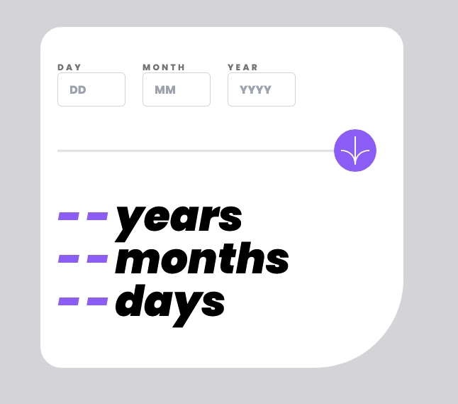

# Frontend Mentor - Age calculator app solution

This is a solution to the [Age calculator app challenge on Frontend Mentor](https://www.frontendmentor.io/challenges/age-calculator-app-dF9DFFpj-Q). Frontend Mentor challenges help you improve your coding skills by building realistic projects.

## Table of contents

- [Overview](#overview)
  - [The challenge](#the-challenge)
  - [Screenshot](#screenshot)
  - [Links](#links)
- [My process](#my-process)
  - [Built with](#built-with)
- [Author](#author)

## Overview

### The challenge

Users should be able to:

- View an age in years, months, and days after submitting a valid date through the form
- Receive validation errors if:
  - Any field is empty when the form is submitted
  - The day number is not between 1-31
  - The month number is not between 1-12
  - The year is in the future
  - The date is invalid e.g. 31/04/1991 (there are 30 days in April)
- View the optimal layout for the interface depending on their device's screen size
- See hover states for all interactive elements on the page

### Screenshot

### Links

- Solution URL: [solution](https://www.frontendmentor.io/solutions/responsive-age-calculator-using-tailwind-css-Sv9LbnK678)
- Live Site URL: [live site](https://age-calculator-react-w911.onrender.com/)

## My process

### Built with

- [React](https://reactjs.org/) - JS library
- Tailwind CSS
- Flexbox
- Mobile-first workflow

## Author

- Website - [Tanmoy Sarkar Pranto](https://portfolio-new-a34w.onrender.com/)
- Frontend Mentor - [@Tanmoy-Sarkar-Pranto](https://www.frontendmentor.io/profile/Tanmoy-Sarkar-Pranto)
